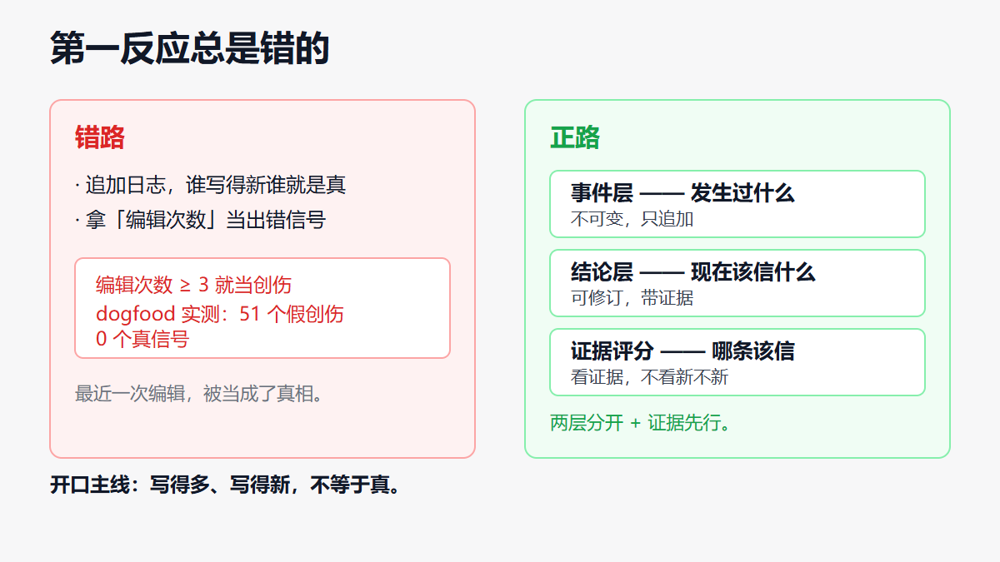
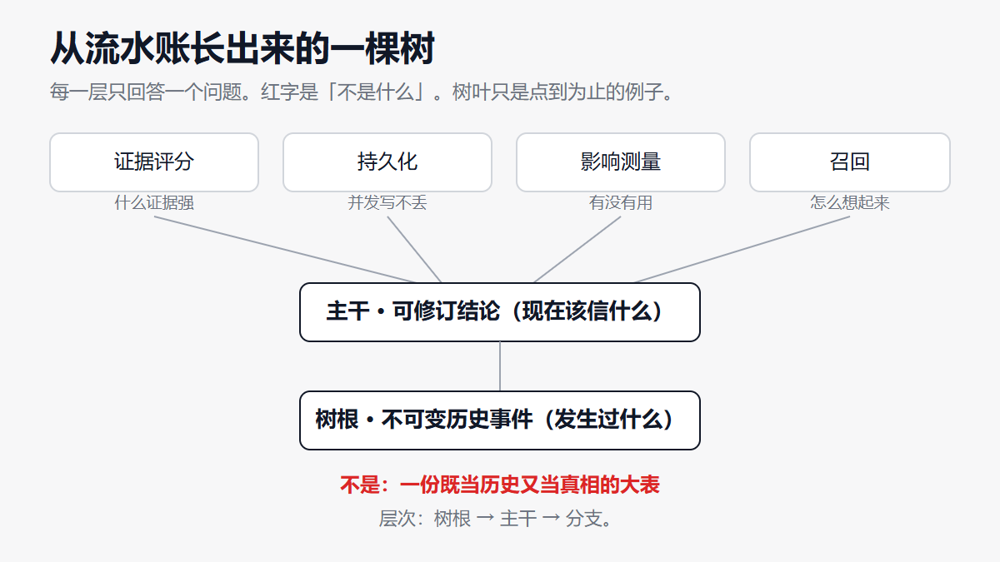
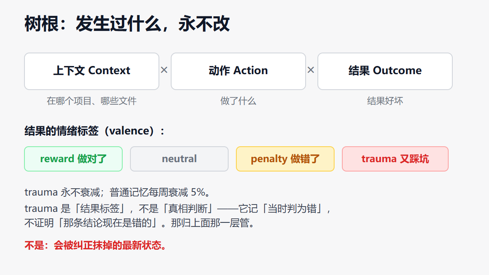
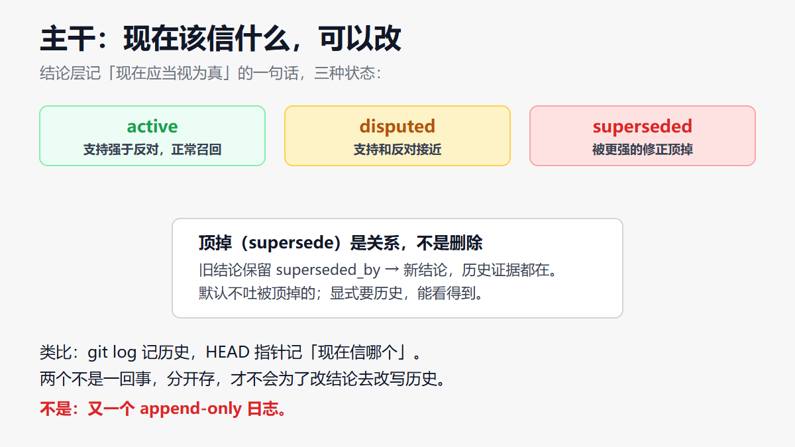
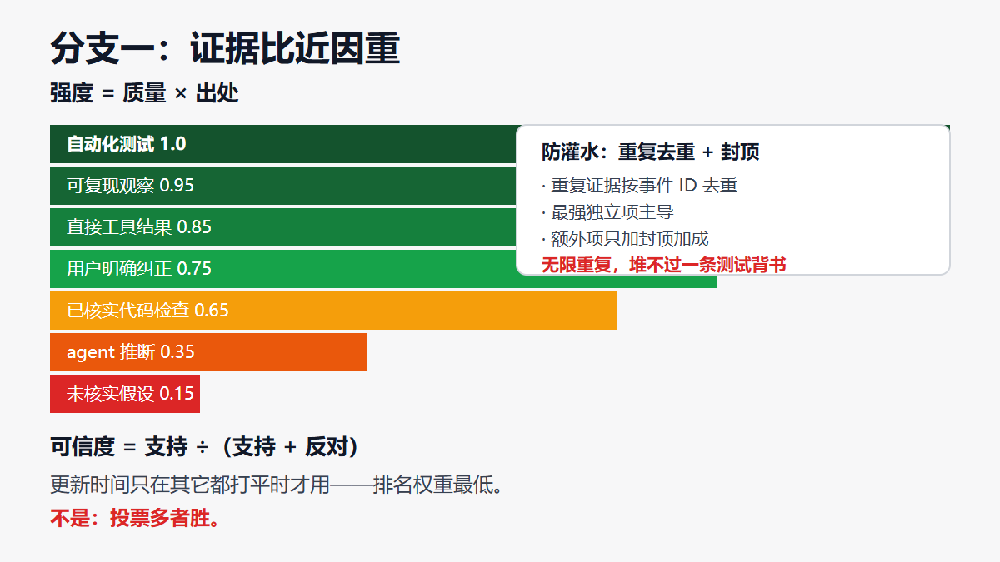
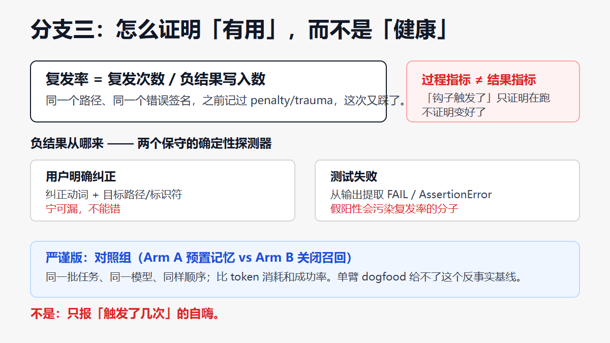
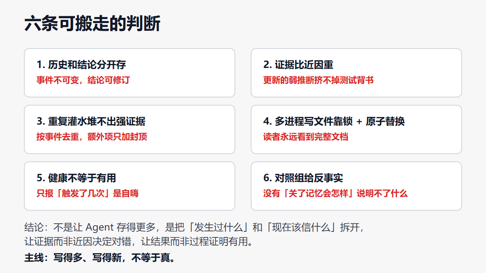

# 给 AI 编程 Agent 加记忆：写得多、写得新，不等于真

**TL;DR**

- 这套「情节记忆」真正做的事不是存得多，是把「发生过什么」和「现在该信什么」拆成两层：历史事件不可变，当前结论可修订。
- 证据有质量分：一份自动化测试的背书，压得过一万次重复的口头推断。重复灌水堆不出强证据。
- 记忆「健康」（存了、召回了）不等于记忆「有用」（Agent 真的少犯错了）。要证明有用，只能看结果指标——复发率降没降。
- 多进程同时写一个文件不丢数据，靠目录锁 + 原子替换：读者永远看到完整文档，不会看到写了一半的。
- 能搬走的不是某几个文件，是三刀：事件和结论分开、证据比近因重、结果比过程重。

---

## 为什么给 Agent 加记忆，先想清楚要压什么

一个 AI 编程 Agent 今天在 `src/retry.ts` 里把重试上限写成 3 导致线上炸了，明天还会不会踩同一个坑？加记忆，就是为了让它跨会话记住教训。

但这篇不是再讲一遍「怎么存 JSON」。它要压的是三件记忆系统最容易骗人的事：

1. **历史不等于真相。** Agent 最后改的那一版，只是「最近发生的事」，不代表「现在对的结论」。
2. **重复不等于证据。** 同一个说法写一百遍，它的可信度不会变成一百倍。
3. **健康不等于有用。** 钩子触发了、事件存了、召回排序不错——这些都只能证明「记忆系统在跑」，不能证明「Agent 变好了」。

贯穿全文一句话：**写得多、写得新，不等于真。**


---

## 第一反应总是错的

要给 Agent 加「经验」，第一反应通常是三件快事：把每次写入都追加进一个日志、按「最近写得新」当真相、拿「编辑次数」当出错信号。这三条会在同一处裂开：

- 追加日志 + 「最新即真相」，等于让 Agent 把刚犯的错又当成对的。
- 「编辑次数 ≥ 3 就记一次创伤」——在真实的 dogfood 数据上，这个启发式产出了 **51 个假创伤、0 个真信号**。噪声无穷大。

正路是把记忆拆成两层：一层记「发生了什么」，永远不改；一层记「现在该信什么」，可以改。再配一层证据评分，决定哪条该信。



开口那句主线先放这：**写得多、写得新，不等于真。** 后面每一刀，都从这句切下去。

---

## 五步，顺序不能乱

前一步走错，后面写得再漂亮，也会在同一处裂开。


| 步 | 是什么 | 不是什么 |
|---|---|---|
| 需求 | 让 Agent 跨会话记住教训，下次不再犯 | 一个存得更全的日志 |
| 接缝 | 事件层记历史，结论层记真相，各管各的 | 一份既当历史又当真相的大表 |
| 树根 | 不可变的历史事件，流水账，只追加 | 会被「纠正」改写的最新状态 |
| 主干 | 可修订的当前结论，带证据和状态 | 又一个 append-only 日志 |
| 切开 | 证据比近因重；结果比过程重 | 靠重复次数、编辑次数定对错 |

这张表是全文唯一一份对照清单。下面把每一层用人话走一遍。

---

## 一棵从流水账长出来的树

记忆不是一个开关。它是从流水账长出来的。每一层只回答一个问题。红字是「不是什么」。



层次就是：**树根 → 主干 → 分支**。树叶（具体文件、函数）只是点到为止的例子。

---

## 树根：发生过什么，永不改

每条历史事件是一个三元组：**上下文 × 动作 × 结果**。结果带一个情绪标签——reward（做对了）、neutral、penalty（做错了）、trauma（同一个坑又踩了一次）。

关键在「永不改」：后来的纠正，不重写这条事件的时间戳、动作、结果、出处。它就在那儿，作为证据留着。类比：它就是 git 的 commit log，只追加，不 rewrite。



trauma 这种强负面记忆，衰减速率是 0——它永远不淡忘。普通记忆每周衰减 5%。但注意：trauma 是「结果标签」，不是「真相判断」。一个事件记着「这件事当时被判为错」，它不能证明「那条结论现在是错的」——那是上面那一层的事。

---

## 主干：现在该信什么，可以改

结论层记的是「现在应当视为真」的一句话，比如「重试上限是 5」。它有三种状态：

- **active**：当前支持强于反对，正常召回。
- **disputed**：支持和反对接近，或者反对更强但没到能顶掉的程度。
- **superseded**：被一条更强的修正顶掉了。

顶掉（supersede）是关系，不是删除。旧结论保留 `superseded_by` 指向新结论，历史证据都在。默认召回不吐被顶掉的，但显式要历史时能看到。

一句话：**git log 记历史，HEAD 指针记「现在信哪个」。** 两个是不同的东西，分开存，才不会为了改「当前结论」去改写历史。



---

## 分支一：证据比近因重

凭什么说一条结论该信？看证据，不看它写得新不新、重复了几次。

每条证据有「质量 × 出处」两个维度。质量的初始排序很直白：

```
自动化测试 1.0 > 可复现观察 0.95 > 直接工具结果 0.85
> 用户明确纠正 0.75 > 已核实代码检查 0.65
> agent 推断 0.35 > 未核实假设 0.15
```

强度 = 质量权重 × 出处权威。关键防灌水设计：**重复证据按事件 ID 去重**，最强的独立项主导，额外的只加一个封顶的加成。所以无限重复，最多堆到封顶，堆不过一条更高质量的单一来源。

结论的可信度 = 支持 ÷（支持 + 反对）。状态由它和「顶掉」关系推出。更新时间的排名权重最低——只在其它都打平时才用。



这套规则的落点是一句反直觉的话：**一条更新的、但更弱的 agent 推断，不能仅仅因为「更新」就挤掉一条测试背书的结论。**

---

## 分支二：多进程写一个文件，怎么不丢

AI Agent 的钩子是独立进程，两个进程可能同时读同一个记忆文件、再互相覆盖。这里不能靠「进程内缓存每 10 条存一次」——独立进程的计数器永远到不了 10。

真正的做法是三件套：

1. **目录锁**：原子地 `mkdir` 一个锁目录，同一时刻只有一个进程能建成功。等锁有上限——钩子最多 5 秒，CLI 10 秒，超时就放弃，绝不无限等。
2. **原子替换**：写一个唯一命名的临时文件，写完 fsync，再 rename 顶上去。**从不先删原文件**，所以读者永远看到「旧的完整文档」或「新的完整文档」，不会看到写了一半的。
3. **store 权威、index 派生**：正文那份 `.wolf` 数据是权威，索引是派生出来的、能根据正文重建。崩溃了索引对不上，下次召回检测到漂移就重建。store 先存、index 后存，两者不是文件系统级的原子提交——承认这个限制，用「可检测、可修复」补上。

还有一条边界：一个项目在 `D:` 盘，钩子不能把 `C:` 盘上不相干的文件当成项目内的。路径判断用 Windows 语义、比较盘符 root，跨盘、父目录逃逸、相似前缀兄弟都拦在外面。


---

## 分支三：怎么证明「有用」，而不是「健康」

这是最容易自嗨的地方。已有的数字——重复读拦截了几次、召回命中了几次——全是**过程指标**，证明「机制在跑」，证明不了「Agent 变好了」。

缺的是**结果归因**和**对照组**。核心结果指标只有一个：

```
复发率 = 复发次数 / 负结果写入数
```

一个「复发」是：同一个路径、同一个错误签名，之前已经记过 penalty/trauma，这次又踩了。复发率跨会话下降，才是「大脑在学」的一级主张。

负结果从哪来？不再靠「编辑次数 ≥ 3」（那套产出 51 个假创伤）。改成两个保守的确定性探测器：

- 用户明确纠正（`UserPromptSubmit` 里检测「纠正动词 + 目标路径/标识符」）；
- 测试失败（从工具输出里提取 `FAIL` / `AssertionError` 等）。

两个都要求「可观测信号」，宁可漏，不能错——因为假阳性会污染复发率的分子。

严谨版还要对照组：Arm A 预置了陷阱记忆，Arm B 把召回关掉，同一批任务、同一个模型、同样的顺序跑，比 token 消耗和成功率。单臂 dogfood 给不了这个「假如大脑不在」的反事实基线。



---

## 收获和结论

树叶会改名。能抄走的是下面六句。



**收获**

1. **历史和结论分开存。** 事件不可变，结论可修订。git log 和 HEAD 不是一回事。
2. **证据比近因重。** 更新的弱推断，挤不掉更旧的测试背书。
3. **重复灌水堆不出强证据。** 按事件去重，额外项只加封顶加成。
4. **多进程写一个文件，靠锁 + 原子替换。** 读者永远看到完整文档，不是写一半的。
5. **健康不等于有用。** 只报「钩子触发了」是自嗨；报「复发率降了」才算数。
6. **对照组给反事实。** 没有「关了记忆会怎样」的基线，单臂数据说明不了什么。

**结论**

给 AI 编程 Agent 加记忆，不是让它存得更多，更不是把「最近写的」当真相。是把「发生过什么」和「现在该信什么」拆开，让证据而不是近因决定对错，让结果而不是过程证明有用。这三刀，才是能搬走的东西。

**PS.** 只带走一句的话：写得多、写得新，不等于真。

**PPS.** 最容易混淆的邻居是「把记忆做得更全、召回更准」。那是过程层面的优化；这篇文章在讲的是「怎么不把最近一次编辑当真相、怎么证明真的有用」。存储和检索再顺，也替代不了这两刀。

**PPPS.** 文里的数值（0.65 / 0.2 / 5%）都会随版本变。你自己系统里若只做 append-only、把编辑次数当信号、拿「触发了几次」当「变好了」——裂开的会是同一刀。那一刀切的，正是「记忆到底是在帮忙，还是在自嗨」。
