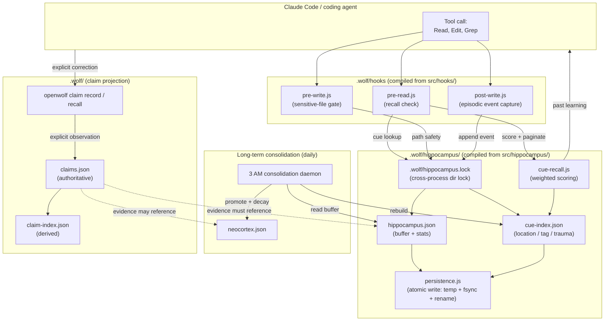
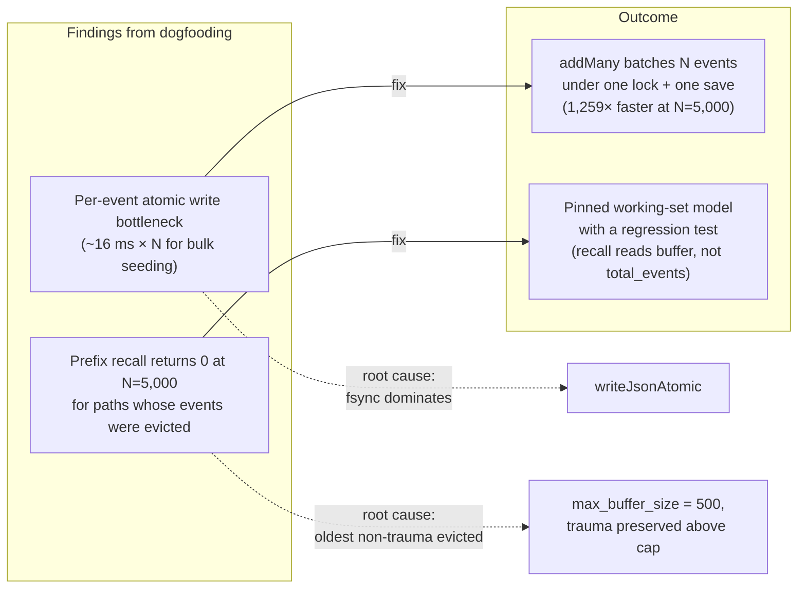

# OpenWolf dogfooding journey

## What we did

OpenWolf is a memory and context layer for AI coding assistants. The source tree at `c:\Git-repo-AI\openwolf` is not a museum copy — it is the live installation we run every day. We dogfood the repository by building it, installing its own hook scripts into its own `.wolf/` runtime, and exercising that runtime as we work on the codebase itself. Every edit, read, and tool call goes through the same hooks a downstream user gets from `npm i openwolf`. The harness for this dogfood session was Claude Code itself, working on the OpenWolf source.

This document records what the dogfood cycle produced, why we run it, and how the pieces fit together.

## Why we do it

Three reasons, in order of importance:

1. **Eat your own dog food.** A memory and recall system that the maintainers do not use will quietly rot. The moment we ask "did OpenWolf actually surface a relevant past learning on this edit?", and answer it ourselves, bugs in recall, path safety, and atomic writes surface within minutes instead of weeks.
2. **Performance under real workloads.** Synthetic benchmarks show throughput. Dogfooding shows the shape of the load — hook rate, project size, cue distribution, trauma ratio, recall latency as perceived by a working agent. Our perf pass on `addMany` (1,259× faster seeding at N=5,000) only mattered because we noticed the per-event cost while replaying events during a real bug investigation.
3. **Truth maintenance, not just memory.** The hippocampus stores what happened. The claim store stores what is currently believed. Without dogfooding, "currently believed" tends to drift toward "what the latest model output said". Running the claim CLI on real corrections during the dogfood cycle is the only way to keep the projection honest.

## How we do it

The dogfood loop has four phases per change, all running in the same working tree.

### 1. Install and refresh

The source tree is intentionally excluded from the normal `openwolf update` registry, so the refresh procedure is direct:

```bash
pnpm build
pnpm build:hooks
node dist/bin/openwolf.js init --agent claude
```

`init` preserves user data while replacing hook scripts, the compiled hippocampus runtime, protocol files, and the Claude hook settings. The installed runtime at `.wolf/` is byte-identical to the freshly built `dist/src/` artifacts, so what the hooks execute is what the tests verify.

### 2. Live verification

After refresh, we run the harness on a real task: open a file, read a sibling, write a fix, ask for a recap. Each hook fire is a real load on the hippocampus. We check:

- did the pre-read hook surface a relevant past learning?
- did the post-write hook ignore files outside the project?
- did the new event land in `hippocampus.json` *and* the matching `event_ids` set in `cue-index.json`?
- did a follow-up edit to a related file recall the just-stored event?

If any of those checks fail, we have a bug. We do not move on until the next pass through the loop is clean.

### 3. Self-test and report

Each substantive change produces a report under `docs2/`:

- `docs2/hippocampus-dogfood-verification.md` — the live-installation check that the hardened hooks behave correctly in the actual `.wolf/`.
- `docs2/hippocampus-hardening-overview.md` — what changed during the hardening pass and why each gap mattered.
- `docs2/hippocampus-addmany-self-test.md` — the `addMany` batching work: 36/36 tests, perf table, concurrency stress.

The reports are committed alongside the code so future contributors can see the rationale, not just the diff.

### 4. Merge into main

Feature branches ship through `--no-ff` merges into `main` once tests pass and reports are written. `feat/hippocampus-hardening` and `feat/hippocampus-addmany` both landed this way.

## How the system fits together

The dogfood cycle exercises every layer of the runtime. The diagram below is the actual data path from a hook invocation to a recalled event.



### What each layer is responsible for

- **Hooks** are short-lived child processes. They do not hold state across invocations; everything they need to decide comes from disk.
- **Hippocampus lock** is a directory under `.wolf/` whose existence a process owns via an `owner.json` token. Every mutation acquires it before reading the store. This is why 8 parallel writers observed zero lost updates during the concurrency stress.
- **Persistence** writes to a sibling temp file, `fsync`s, then renames over the canonical file. Readers see either the old complete document or the new complete document — never a half-written one.
- **Cue index** is rebuilt from the buffer after every mutation. It carries a complete `event_ids` watermark so a reader can detect drift and rebuild itself.
- **Recall** reads the cue index, scores each candidate by location / recency / valence / intensity, and paginates. The active working set is the capped buffer (`max_buffer_size: 500`, with trauma events preserved above the cap). Recall does not see the long-term store directly.
- **Consolidation** is a daily daemon. It promotes events past a salience threshold, decays stale ones, and enforces the neocortex size cap. The cue index is rebuilt afterwards.
- **Claim store** is a separate projection. It is not a passive byproduct of events — every claim must name its evidence (`event_id`) and the evidence must resolve to either the short-term buffer or the long-term neocortex. This fails closed: a missing event means the observation is rejected, not stored as a partial truth.

### What the dogfood session changed in this cycle

The dogfood cycle for this repository, run as the agent working on its own source, surfaced two things worth fixing:



- **Bottleneck.** Bulk seeding at N=5,000 took 93,565 ms because every event triggered a full lock + atomic write cycle. Real hooks fire at human pace, so this never shows up in production — but dogfooding surfaced it when replaying events during a recall-bug investigation. Fix: `Hippocampus.addMany(events)` collapses the batch into a single lock + a single store write + a single index write, preserving the same all-or-nothing atomicity.
- **Working-set model.** At N=5,000 with 20% trauma valences, the buffer holds the 1,000 trauma events plus the 500 newest non-trauma events. Recall for a path whose non-trauma events were among the oldest returns 0 by design — not because of a scoring bug, but because the working set is bounded. Pinning this with a regression test (`tests/hippocampus-addmany.test.ts`) means the next person who sees the same number will know it is intentional.

## Limits we accept

- The dogfood loop is sequential with the harness. We do not run the installed `.wolf/` against an unrelated project in parallel; it would dilute the working-set signal.
- `addMany` is a write API. Long-term consolidation still runs from the daily daemon. Batch writes do not bypass it.
- We do not promote agent-inferred contradictions automatically. Corrections must go through the claim CLI and name their target. This is enforced by the truth-maintenance model, not by a politeness guideline.
- The installed `.wolf/` JavaScript is generated runtime. Source of truth is `src/`; tests live in `tests/`; rationale lives under `docs2/`.

## Related documents

- `docs2/hippocampus-dogfood-verification.md` — the live-installation check.
- `docs2/hippocampus-hardening-overview.md` — what the hardening pass fixed and why each gap mattered.
- `docs2/hippocampus-addmany-self-test.md` — the `addMany` work, with the perf table and concurrency results.
- `docs2/hippocampus-storage-and-locking.md` — the cross-process lock and atomic write protocol.
- `docs2/hippocampus-path-safety-and-recall.md` — how paths are normalized and how recall shares that normalization.
- `docs2/truth-maintenance.md` — the claim projection on top of the hippocampus.